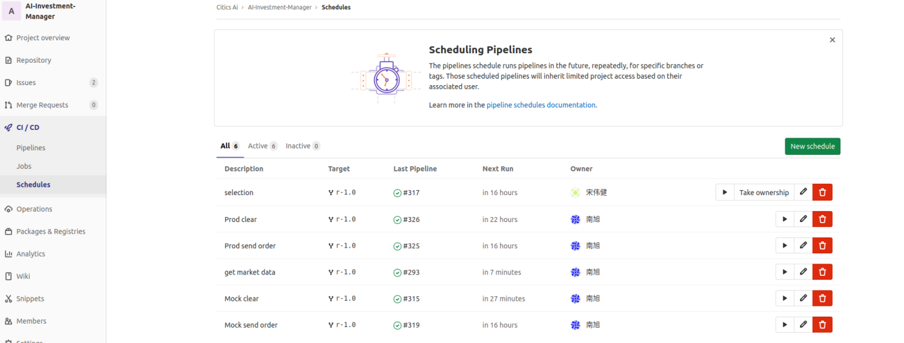

# 四、安装条件及策略部署
## （一）安装的前提条件
操作系统： Ubuntu 20.04
## （二）代码包文件及目录说明
代码包	|说明
|-----|-----
ai-investment-manager|智能投资策略代码
## （三）策略部署
### 1、安装gitlab-runner
如已配置gitlab-runner需要新注册一个runner，只需要执行第7步
#### （1）下载
```shell
$  sudo wget -O /usr/local/bin/gitlab-runner https://gitlab-runner-downloads.s3.amazonaws.com/latest/binaries/gitlab-runner-linux-amd64
```
#### （2）修改权限
```shell
$  sudo chmod +x /usr/local/bin/gitlab-runner
```

#### （3）创建一个gitlab-runner用户：
```shell
$  sudo useradd --comment 'GitLab Runner' --create-home gitlab-runner --shell /bin/bash
```

#### （4）安装和配置home文件夹，此命令会在/home目录创建gitlab-runner用户的文件：
```shell
$  sudo gitlab-runner install --user=gitlab-runner –working-directory=/home/gitlab-runner
```

#### （5）修改gitlab-runner用户的密码：
```shell
$  sudo su root
$  passwd gitlab-runner
$  输入新gitlab-runner用户的新密码
```

#### （6）进行gitlab-runner用户的ssh免密码登录设置：
```shell
$  su gitlab-runner
$  git init
$  git config --global user.name 用户名
$  git config --global user.email 用户邮箱
其中用户名和邮箱任意
$  ssh-keygen -t rsa
$  cat ~/.ssh/id_rsa.pub
内容复制到gitlab设置ssh里，见下图右侧
```


#### （7）注册gitlab-runner：
```shell
切换为非gitlab-runner用户
$  sudo gitlab-runner register
```
根据提示输入对应项目的配置，见下图。URL和registration token根据下图进行复制，tags自己设定，但需与yml文件（下述）tags保持一致，executor选择shell即可<br>
<br>


#### （8）设置并发数
```shell
$  vim /etc/gitlab-runner/config.toml
```
第一行为concurrent数量，默认是1，修改成需要的数字保存

#### （9）启动runner
```shell
$  sudo gitlab-runner start
如果start失败，可执行
$  sudo gitlab-runner verify
然后
$  sudo gitlab-runner restart
```
### 2、编辑yml脚本
在项目根目录下创建一个gitlab-ci.yml文件（文件名不能更改），以下为参考范例，实现的功能是拉取目标分支代码，切换到某一个tag（以version参数值为准），运行[dailyTask.sh](../dailyTask.sh)，参数为PARAM，version和PARAM参数设定详解见第4步（自动化部署）：<br>
```
 stages:
  - test
job1:
  stage: test
  tags:
    - investment-manager
  only:
    - /^r-.*$/  
  script:
    - cd /home/gitlab-runner/ai-investment-manager/
    - echo $CI_COMMIT_REF_NAME
    - git checkout $CI_COMMIT_REF_NAME
    - git pull
    - git checkout $version
    - bash dailyTask.sh $PARAM
```

* 参数详解：<br>
**stages**:定义pipeline的全部阶段（stage），阶段内所有任务并行执行，全部执行成功开始下一阶段任务，任何阶段内任意job执行失败都会导致pipeline失败，所有stage，job执行成功后pipeline会显示pass。如果未定义stages，则默认有build、test、deploy三个阶段，如果未定义stage，则默认test阶段;<br>
**job1**:任务名称，可自由定义;<br>
**stage**:关键字，用于指定任务在什么stage运行;<br>
**tags**:关键字，用于关联上一步设置的gitlab-runner，应对多个gitlab-runner任务匹配问题;<br>
**script**：关键字，按顺序撰写该任务的shell脚本；<br>
**only**：关键字，用于指定依赖的代码分支，可支持正则表达式；

### 3、安装根网依赖
根网依赖位置在ai-investment-manager包里，路径为
[ai-investment-manager/tradingSystem/rootNet/rootNetInstall](../tradingSystem/rootNet/rootNetInstall)
进入上述路径并执行
```shell
$  python3 setup.py install
```

### 4、自动化部署
##### （1）进入CI/CD目录下Schedule界面，点击New schedule


##### （2） 设置参数
范例见下图<br>
<br>
**interval Pattern** 为定时任务运行时间<br>
**Cron Timezone**为时区，选Beijing<br>
**Target Branch**为目标分支，作用是运行目标分支的yml文件<br>
**Variables**指为yml传入的参数，第一列为变量类型，第二列为变量名，第三列为变量值<br>
**version**为相应tag版本<br>
**PARAM**参数代表运行不同的脚本<br>
对应关系见dailyTask.sh，可自行编写，范例见下图<br>
<br>
**Activated**表示是否运行定时任务<br>
部署完成点**save pipeline schedule**

##### （3）任务查看点击（1）步中的last pipeline列，可以看到对应任务的执行情况，见下图，点击job1可以通过终端显示查看代码运行情况


### 5、定时任务汇总
* （1）每日9：00 运行选股脚本
* （2）每日9：26 运行生产环境订单脚本
* （3）每日9：27 运行模拟环境订单脚本
* （4）每日15：10 运行生产环境清算脚本
* （5）每日17：00 运行落当日行情数据脚本
* （6）每日17：20 运行模拟环境清算脚本
